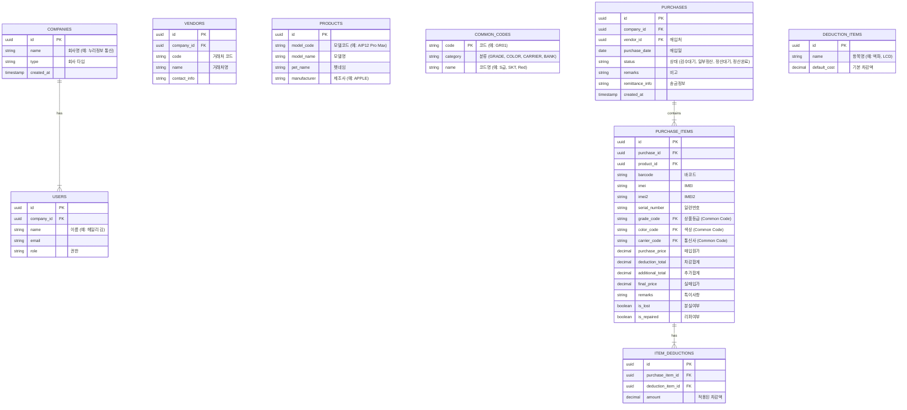

# `purchase_01.html` 심층 분석 보고서

## 1. 📊 데이터베이스 설계 (ERD)
`purchase_01.html`의 입력 필드와 데이터 구조를 분석하여 Supabase(PostgreSQL)에 적합한 ERD를 설계했습니다.



---

## 2. 🧩 컴포넌트 구조 분해 (Next.js)
거대한 HTML 파일을 유지보수 용이한 리액트 컴포넌트 계층으로 분리했습니다.

### 📂 Directory Structure
```text
src/
├── components/
│   ├── layout/
│   │   ├── Sidebar.tsx          <!-- 좌측 메뉴 (LNB) -->
│   │   ├── Header.tsx           <!-- 상단 프로필 및 정보 -->
│   │   └── MainLayout.tsx       <!-- 전체 레이아웃 래퍼 -->
│   ├── purchase/
│   │   ├── PurchaseSearchForm.tsx   <!-- 상단 검색/입력 폼 (매입정보, 상품정보) -->
│   │   ├── DeductionChecklist.tsx   <!-- 원가차감항목 체크박스 그룹 -->
│   │   ├── PurchaseTable.tsx        <!-- 메인 매입 목록 테이블 -->
│   │   ├── TableToolbar.tsx         <!-- 테이블 위 기능 버튼들 (전표초기화 등) -->
│   │   └── SummaryStats.tsx         <!-- 좌측 하단 검색결과 요약 -->
│   ├── common/
│   │   ├── ModalWrapper.tsx     <!-- 팝업 공통 래퍼 -->
│   │   └── DatePicker.tsx       <!-- 달력 컴포넌트 -->
│   └── modals/
│       ├── VendorSearchModal.tsx    <!-- 매입처 검색 (#searchBuyCompany) -->
│       ├── ProductSearchModal.tsx   <!-- 상품 모델 선택 (#findProduct) -->
│       ├── PriceAdjustmentModal.tsx <!-- 매입가 일괄조정 (#priceAdjustment) -->
│       ├── LostPhoneSearchModal.tsx <!-- 분실도난 일괄조회 (#lossIntegrated) -->
│       └── VoucherHistoryModal.tsx  <!-- 상품별 전표처리 내역 (#voucherDetails) -->
```

### 🔑 Key Components Detail
*   **`PurchaseSearchForm`**: `purchase_01.html`의 상단 `search_box_area`를 담당합니다. 복잡한 입력 로직을 `react-hook-form`으로 관리하는 것을 권장합니다.
*   **`PurchaseTable`**: `ag-grid` 또는 `tanstack-table`과 같은 강력한 데이터 그리드 라이브러리 사용을 고려해야 합니다. (행 삭제, 정렬, 체크박스 기능 필요)
*   **`DeductionChecklist`**: 차감 항목이 매우 많으므로(액파, LCD 등), 이를 동적으로 렌더링하는 별도 컴포넌트로 분리하여 관리합니다.

---

## 3. 🌍 글로벌화(i18n) 전략
하드코딩된 한글 텍스트를 추출하여 `next-i18next` 또는 `react-i18next`에서 사용할 수 있는 JSON 구조로 정리했습니다.

### 📂 locales/ko/purchase.json
```json
{
  "pageTitle": "매입관리",
  "search": {
    "title": "매입정보",
    "date": "매입일",
    "vendor": "매입처",
    "remarks": "비고",
    "remittanceInfo": "송금정보",
    "settlementStatus": {
      "label": "정산현황",
      "waitingInspection": "검수대기",
      "partialSettlement": "일부정산",
      "waitingSettlement": "정산대기",
      "completed": "정산완료"
    },
    "compareSettlement": "정산비교"
  },
  "productInfo": {
    "title": "상품정보",
    "barcode": "Barcode",
    "marketPriceTop50": "시세(Top50)",
    "model": "모델",
    "ismi": "ISMI",
    "serialNumber": "일련번호",
    "purchaseCost": "매입원가",
    "grade": "상품등급",
    "carrierColor": "통신/색상",
    "remarks": "특이사항",
    "fixed": "고정"
  },
  "deduction": {
    "title": "원가차감항목",
    "screenCrack": "액파",
    "lcdDefect": "LCD",
    "cameraDefect": "카메라불량",
    "touchDefect": "터치 불량",
    "biometricDefect": "지문/페이스",
    "wifiDefect": "WIFI 불량",
    "totalDeduction": "차감합계",
    "fixDeduction": "차감액 고정"
  },
  "actions": {
    "resetVoucher": "전표초기화",
    "inactiveIphone": "비활성아이폰",
    "reRequestInfo": "폰정보 재요청",
    "setupBarcode": "Barcode 설정",
    "deleteRow": "행삭제",
    "deleteVoucher": "전표삭제",
    "input": "입력",
    "save": "저장",
    "saveAndContinue": "저장 후 계속",
    "reset": "초기화"
  },
  "table": {
    "modelName": "모델명",
    "petName": "펫네임",
    "imei": "IMEI",
    "purchaseCost": "매입원가",
    "deductionAmount": "차감금액",
    "additionalAmount": "추가금액",
    "actualPrice": "실매입가",
    "lostStatus": "분실여부"
  }
}
```

### 💡 Implementation Tips
1.  **동적 키 생성**: 차감 항목("액파", "LCD" 등)은 DB에서 관리될 가능성이 높으므로, 번역 파일보다는 DB의 `name_ko`, `name_en` 컬럼을 통해 동적으로 처리하는 것이 좋습니다.
2.  **공통 용어**: "저장", "취소", "검색" 등은 `common.json`으로 분리하여 재사용합니다.
